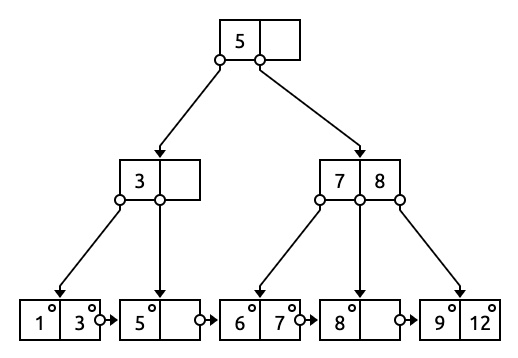

# SQL-CS008-Final-Project

# Overview / Supported Commands
### Select (Query from an existing table):
```
select * from TABLE-NAME
select FIELD-NAME(S) from TABLE-NAME
select _ from TABLE-NAME where BOOLEAN-EXPRESSION
```

### Insert (Insert a new entry into an existing table)
```
insert into TABLE-NAME values VALUES
```

### Make (Create a new table and specify fields for entries)
```
make table TABLE-NAME fields FIELD-NAMES
```

# Demonstration: 
GIF Demonstration With Existing Table of Famous Scientists: <br>
 


Example Query Outputs From A Table Called "scientists" With 70 Entries
```
select * from scientists where NATIONALITY = English and LAST >= R or NATIONALITY = Italian and YEAR < 1500 or NATIONALITY = German and YEAR > 1900
TABLE NAME: scientists-9
NUMBER OF RECORDS: 4
#:                     FIRST                     LAST                     YEAR                INVENTION              NATIONALITY
0:                    Werner               Heisenberg                     1901    Uncertainty principle                   German
1:                   Wernher                von Braun                     1912                 Rocketry                   German
2:                  Leonardo                 da Vinci                     1452   Renaissance inventions                  Italian
3:                      Alan                   Turing                     1912                Computing                  English


select FIRST, YEAR from scientists where ((FIRST >= Aa and FIRST <= Az) or (FIRST >= AA and FIRST <= AZ))
TABLE NAME: scientists-10
NUMBER OF RECORDS: 9
#:                     FIRST                     YEAR
0:                       Ada                     1815
1:                      Alan                     1912
2:                    Albert                     1879
3:                Alessandro                     1745
4:                 Alexander                     1881
5:                    Alfred                     1833
6:                   Antoine                     1743
7:                Archimedes                  0287 BC
8:                 Aristotle                  0384 BC


select FIRST, YEAR from scientists where FIRST >= Aa and FIRST <= Az or FIRST >= AA and FIRST <= AZ
TABLE NAME: scientists-11
NUMBER OF RECORDS: 9
#:                     FIRST                     YEAR
0:                       Ada                     1815
1:                      Alan                     1912
2:                    Albert                     1879
3:                Alessandro                     1745
4:                 Alexander                     1881
5:                    Alfred                     1833
6:                   Antoine                     1743
7:                Archimedes                  0287 BC
8:                 Aristotle                  0384 BC
```
# Parser/State Machine Implementation
A state machine is a computational tool that depends on the process being in one state at a time, and in this program, each state is marked as "success", "fail", or "intermediate". The user types in a command/request, and it is processed by the state machine to determine what the user is trying to accomplish (i.e. create a new table, query a selection, etc.). It begins at the 0th state, which is an intermediate state, and it can only move to the next intermediate state (either 1, 9, or 14) if the next word is either "select", "make", or "insert". This process is repeated until an incorrect value is reached (in which case a "fail" state is triggered and is invalid) or until the entire string is processed. Once the entire string is processeed, it is only valid if it is in a "success" state (the states highlighted in green). If any request is invalid, it is ignored and the user is prompted to enter a different request.

If request is valid, and if the user requests to query a table and provides a boolean expression, then it is processed by a unique shunting yard and reverse polish notation algorithm that handles boolean expressions with field names. The algorthim is dependent on a queue and stack implementation using the processed tokens. The end result of the algorithm is a table that is created from the preexisting table with only the appropriate entries. There is also input validation at this level also to (1) determine if the user has typed in a command that does not exist and (2) determine if the user has typed in an invalid field name (i.e. the user provides a field name of "GENDER" but that is not encapsuled in the table). If an invalid request is issued by the user, the program simply skips over it and prompts the user for a new request. 

 

# Dictionary/B-Plus Tree Implementation
A B-Plus Tree is a balanced search tree that provides efficient logarithmic search times for desired entries. A B-Plus Tree holds all entries in the bottom layer, known as leaves, and every other node serves as a guide to the entries. A B-Plus Tree is useful for querying because it's leaf nodes are connected, providing swift traversal for sequential data. That is, it provides a very fast way to gather all entries that fall in a certain range. This B-Plus Tree provides the backend for the Dictionary/Multi-Map implementation in this project, which allows for logarithmic search times of key-value pairs. This is necessary when the user prompts a query for a range of entries based on a field-name (eg. the set of all entries that satisfy Aa <= FIRST <= Az). <br>
 

# Binary Files Implementation
Binary files (.bin) are versatile and efficient for storing and retrieving large amounts of data, which is why they are commonly used in databases and as a means to store large amounts of image, video, and audio data. In this project, they are implemented to maximize efficiency of query searches by computing the "jump" to the desired entry, or the number of bytes that must be skipped to reach that desired entry based on the set size of entries. 
