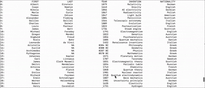
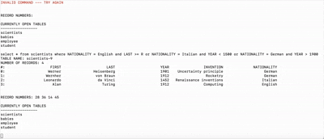
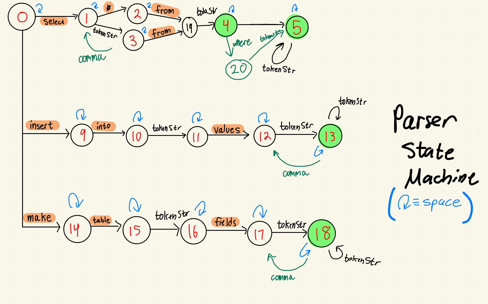

# SQL-CS008-Final-Project

# Overview / Supported Commands
### Select (Query from an existing table):
```
select * from TABLE-NAME
select FIELD-NAME(S) from TABLE-NAME
select _ from TABLE-NAME where BOOLEAN-EXPRESSION
```

### Insert (Insert a new entry into an existing table)
```
insert into TABLE-NAME values VALUES
```

### Make (Create a new table and specify fields for entries)
```
make table TABLE-NAME fields FIELD-NAMES
```

# Demonstration: 
GIF Demonstration With Existing Table of Famous Scientists: <br>
 


Example Query Outputs From A Table Called "scientists" With 70 Entries
```
select * from scientists where NATIONALITY = English and LAST >= R or NATIONALITY = Italian and YEAR < 1500 or NATIONALITY = German and YEAR > 1900
TABLE NAME: scientists-9
NUMBER OF RECORDS: 4
#:                     FIRST                     LAST                     YEAR                INVENTION              NATIONALITY
0:                    Werner               Heisenberg                     1901    Uncertainty principle                   German
1:                   Wernher                von Braun                     1912                 Rocketry                   German
2:                  Leonardo                 da Vinci                     1452   Renaissance inventions                  Italian
3:                      Alan                   Turing                     1912                Computing                  English


select FIRST, YEAR from scientists where ((FIRST >= Aa and FIRST <= Az) or (FIRST >= AA and FIRST <= AZ))
TABLE NAME: scientists-10
NUMBER OF RECORDS: 9
#:                     FIRST                     YEAR
0:                       Ada                     1815
1:                      Alan                     1912
2:                    Albert                     1879
3:                Alessandro                     1745
4:                 Alexander                     1881
5:                    Alfred                     1833
6:                   Antoine                     1743
7:                Archimedes                  0287 BC
8:                 Aristotle                  0384 BC


select FIRST, YEAR from scientists where FIRST >= Aa and FIRST <= Az or FIRST >= AA and FIRST <= AZ
TABLE NAME: scientists-11
NUMBER OF RECORDS: 9
#:                     FIRST                     YEAR
0:                       Ada                     1815
1:                      Alan                     1912
2:                    Albert                     1879
3:                Alessandro                     1745
4:                 Alexander                     1881
5:                    Alfred                     1833
6:                   Antoine                     1743
7:                Archimedes                  0287 BC
8:                 Aristotle                  0384 BC
```
# Parser/State Machine Implementation
 
# Dictionary/B-Plus Tree Implementation

# Binary Files Implementation
